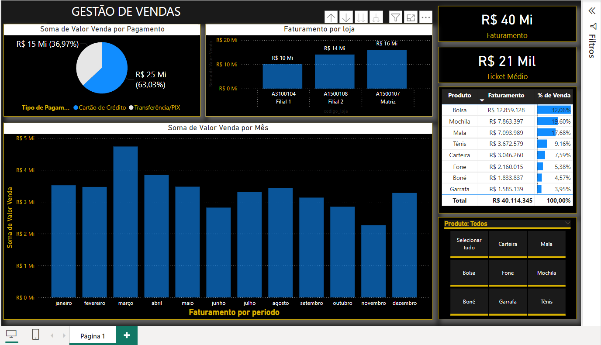

# Gestão de Vendas - Power BI

## Descrição do Projeto

O projeto "Gestão de Vendas" é um dashboard interativo desenvolvido em Power BI para análise de vendas de um E-comerce. Ele fornece insights detalhados sobre o desempenho das vendas, incluindo informações sobre produtos, clientes, métodos de pagamento e muito mais.

## Objetivo

O objetivo deste projeto é permitir que os gestores de vendas e analistas de dados:
- Monitorem o desempenho das vendas em diferentes cidades e segmentos.
- Identifiquem padrões de compras dos clientes.
- Avaliem a eficácia dos métodos de pagamento.
- Analisem o desempenho de diferentes linhas de produtos.
- Tomem decisões informadas com base nos dados.

## Conteúdo do Arquivo

O arquivo "Gestão de Vendas.pbix" inclui as seguintes visualizações e relatórios:
- **Resumo das Vendas**: Visão geral das vendas totais, quantidade vendida, e receita gerada.
- **Análise de Clientes**: Distribuição dos clientes por tipo (membro ou normal), gênero, e cidade.
- **Análise de Produtos**: Desempenho das diferentes linhas de produtos.
- **Métodos de Pagamento**: Preferências de pagamento dos clientes (dinheiro, cartão de crédito, e-wallet).
- **Métricas Financeiras**: Lucro bruto, margem de lucro, e cogs (custo das mercadorias vendidas).

## Fonte de Dados

Os dados utilizados no dashboard são provenientes do arquivo "supermarket_sales.csv", que contém as seguintes colunas:
- **Invoice ID**: Identificação da fatura
- **Branch**: Filial (A, B, C)
- **City**: Cidade (Yangon, Naypyitaw, Mandalay)
- **Customer type**: Tipo de cliente (Member, Normal)
- **Gender**: Gênero do cliente (Male, Female)
- **Product line**: Linha de produtos
- **Unit price**: Preço unitário
- **Quantity**: Quantidade vendida
- **Tax 5%**: Imposto de 5%
- **Total**: Valor total da venda
- **Date**: Data da venda
- **Time**: Hora da venda
- **Payment**: Método de pagamento
- **cogs**: Custo das mercadorias vendidas
- **gross margin percentage**: Percentual de margem bruta
- **gross income**: Renda bruta
- **Rating**: Avaliação do cliente

## Requisitos

Para abrir e visualizar o arquivo "Gestão de Vendas.pbix", é necessário:
- Power BI Desktop instalado (versão mais recente recomendada).

## Instruções de Uso

1. **Abrir o Power BI Desktop**.
2. **Carregar o arquivo "Gestão de Vendas.pbix"**.
3. Navegar pelos diferentes relatórios e visualizações usando o painel de navegação à esquerda.
4. Utilizar os filtros e segmentações disponíveis para explorar os dados de forma interativa.

## Captura de Tela

## Autores

Este projeto foi desenvolvido por Matheus de Oliveira. Para mais informações ou suporte, entre em contato pelo e-mail [seuemail@dominio.com].

## Licença

Este projeto é distribuído sob a licença MIT. Veja o arquivo LICENSE para mais detalhes.
